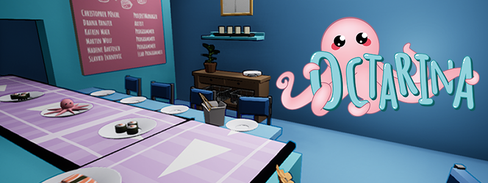

[](https://app.netlify.com/sites/octarina/deploys)

# Octarina Website


## Description

This project contains the code for Octarina's Webiste (https://octarina.netlify.app/). Octarina is a physics-based 3D puzzle platformer featuring a trapped little octopus who must find a way out and escape out of a sushi factory site. You play as an adorable little octopus, which is trapped inside an aquarium for its whole life. Not as a pet, but rather as a sushi ingredient. Escape your captivity and find a way out before it's too late! Use the sticky abilities of Octarina to jump, climb and cause mayhem in the factory. 

Below you can find the description of the most important commands.

## Install Dependencies

```sh 
$ npm i
```

## One time build assets for development

```sh
$ npm run build
```

## Start a development server - reloading automatically after each file change.

```sh
$ npm run dev
```

## Production / Build Assets

* Optimize assets for production by:

```sh
$ npm run production
```

## Run Code Style Linters

* **SASS**

```sh
$ npm run lint:sass
```
* **JS**

```sh
$ npm run lint:js
```